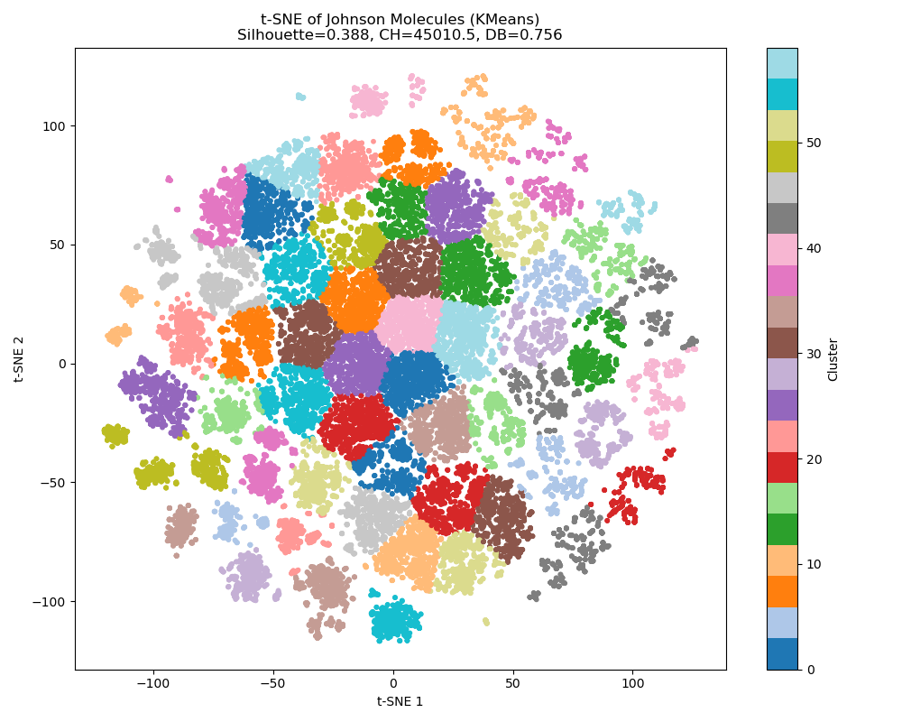

# 化合物库代表性分子筛选

本项目旨在从 Johnson 化合物库中筛选出结构多样、代表性强的分子子集，以更高效地覆盖整个化学空间，从而优化虚拟筛选与实验验证流程。
```
3_johnson/ # 化合物库代表性分子筛选
│
├── Johnson.py # 运行代码
├── 3_johnson.docx # 报告
├── johnson_tsne_kmeans_optimized.png # t-SNE 聚类可视化结果
├── representative_molecules_tsne.csv # 可视化与代表分子列表
├── README.md # 项目说明文档
└── requirements.txt # 环境要求文档
```

---

## 🧪 项目简介

- **任务类型**：无监督聚类（代表性子集筛选）
- **数据集**：[Johnson Compound Annotation Dataset (2019-05-15)](https://www.ncbi.nlm.nih.gov/pccompound)
- **分子数量**：47,217
- **分子表示**：RDKit 分子描述符
- **降维方法**：t-SNE
- **聚类方法**：KMeans（k=60）
- **代表性分子选择**：每簇中与聚类中心最接近的分子

---

## 🔧 运行

```bash
conda create -n johnson python=3.10
conda activate johnson
pip install -r requirements.txt
````

---

## 🚀 快速运行

确保你已将 `2019-05-15_compound-annotation.csv` 放在正确路径，然后运行：

```bash
python Johnson.py
```

运行完成后，会在当前目录输出两个结果文件：

* `johnson_tsne_kmeans_optimized.png`：t-SNE 降维后的聚类可视化图
* `representative_molecules_tsne.csv`：每个簇中的代表性分子（共60个）

---

## 📊 最终聚类效果指标

| 指标名称              | 得分      |
| ----------------- | ------- |
| Silhouette Score  | 0.388   |
| Calinski-Harabasz | 45010.5 |
| Davies-Bouldin    | 0.756   |

该实验满足上述三项指标标准，保证了代表性分子的结构多样性与非冗余性。

---

## 🖼️ 可视化示例

聚类后的 t-SNE 可视化图如下：

<p align="center">
  
</p>
